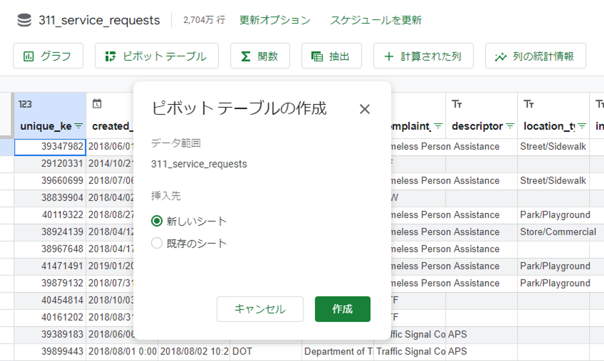
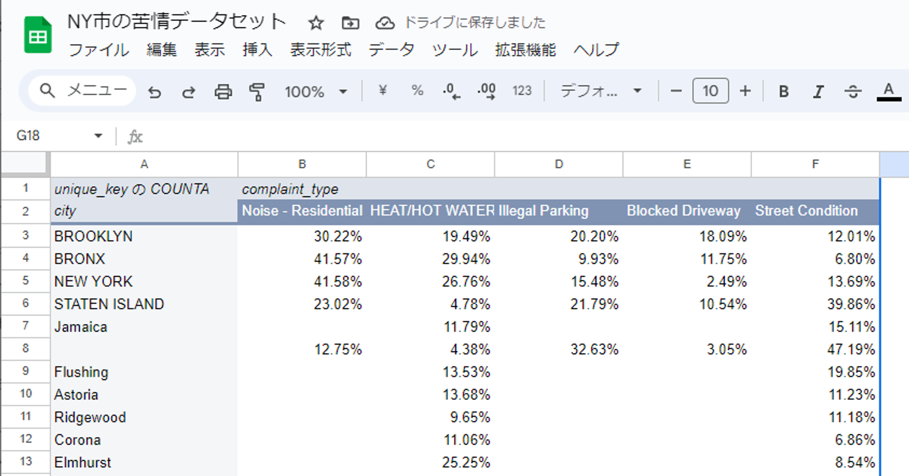

# Googleコネクテッドシート

## BigQuery公開データセットを読み込む

## ピボットテーブルを使った分析

- 苦情が発生した都市の割合が高い順に並んだ

- 列に`complaint_type` を追加し、苦情の種類の内訳が分かるようにする
    - 書籍では列数を50としていたが、もう少し絞らないと空白の多いテーブルになってしまったので5件とした

- `BROOKLIN` , `BRONX` , `NEW YORK` では`Noise Residential` (住宅の騒音)が最も多いが、`STATEN ISLAND` では`Street Condition` (路上の状態)が最も多いことがわかる

## コネクテッドシートでグラフを追加してみる

## コネクテッドシートのまとめ

- BigQueryのテーブルに対するスプレッドシート上での集計がかなり簡単に実現されていた
- 実務でも「ちょっとデータの分布を可視化したい」などで使えそう

